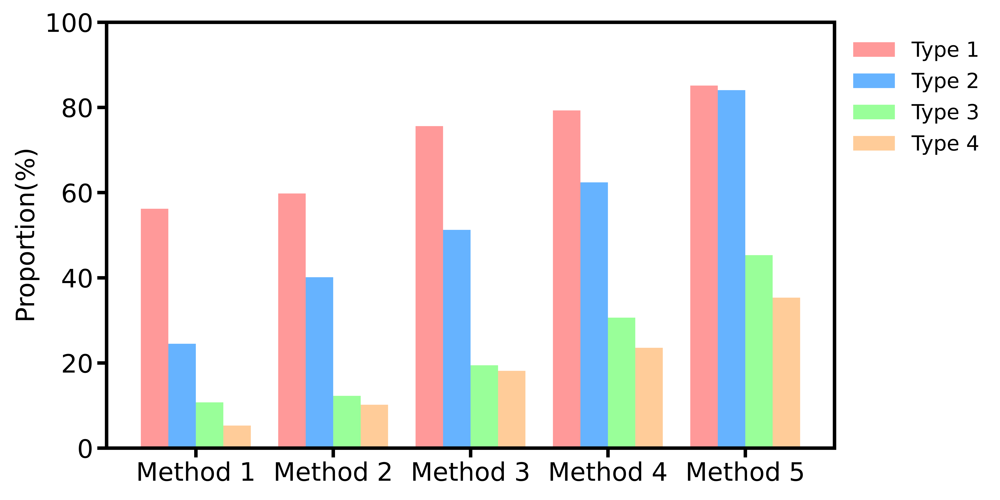

# 简单的分组柱状图

```python
import pandas as pd
import matplotlib.pyplot as plt

# 自定义绘图函数
def myplot(df, filename, ylabel, legend):
    colors = ['#FF9999', '#66B3FF', '#99FF99', '#FFCC99']
    ax = df.plot(kind='bar', figsize=(12, 6), width=0.8, color=colors, linewidth=0)

    # 设置刻度字体大小和标签字体大小
    ax.tick_params(labelsize=22, width=3, length=8)  # 刻度字体大小
    plt.xlabel('', fontsize=22)  # X轴标签字体大小
    plt.ylabel(ylabel, fontsize=22)  # Y轴标签字体大小
    plt.ylim([0, 100])

    # 设置 spines 的宽度
    for spine in ax.spines.values():
        spine.set_linewidth(3)

    # 其他设置
    plt.xticks(rotation=0)  
    ax.legend(legend, frameon=False, fontsize=18, loc="upper left", bbox_to_anchor=(1, 1))
    
    plt.tight_layout()
    # plt.savefig(filename, dpi=600)
    plt.show()

data = [
    [56.18, 24.5, 10.74, 5.28],
    [59.77, 40.13, 12.27, 10.17],
    [75.59, 51.22, 19.43, 18.15],
    [79.29, 62.38, 30.64, 23.54],
    [85.12, 84.03, 45.31, 35.32]
]
filename = "grouped_bar.png"
index = [f"Method {i}" for i in range(1, len(data) + 1)]
ylabel = 'Proportion(%)'
legend = [f"Type {i}" for i in range(1, len(data) + 1)]

df = pd.DataFrame(data)
df.index = index
myplot(df, filename, ylabel, legend)
```

# 效果



