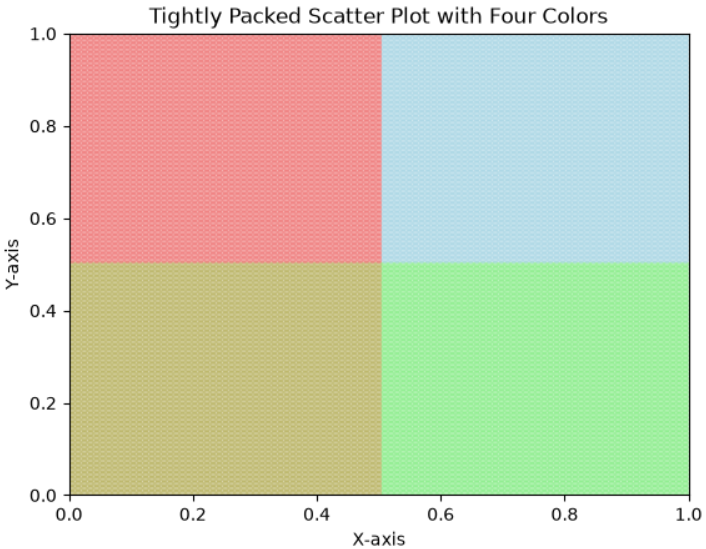

# 紧密排列散点图

```python
import matplotlib.pyplot as plt
import numpy as np
import matplotlib.colors as mcolors

# 设置图形区域范围 [0, 1] x [0, 1]
xlim = (0, 1)
ylim = (0, 1)

# 设置圆点半径
radius = 0.005  # 半径设为 0.025，可根据画布大小调整

# 计算每行和每列可以放置多少个圆点
num_cols = int((xlim[1] - xlim[0]) / (2 * radius)) + 1
num_rows = int((ylim[1] - ylim[0]) / (2 * radius)) + 1

# 生成所有圆点的坐标（紧密排列）
x_values = np.linspace(xlim[0] + radius, xlim[1] - radius, num_cols)
y_values = np.linspace(ylim[0] + radius, ylim[1] - radius, num_rows)

# 将 x 和 y 值组合成所有点的坐标
x, y = np.meshgrid(x_values, y_values)
x = x.flatten()
y = y.flatten()

# 根据坐标位置分配颜色，并添加透明度
colors = []
for xi, yi in zip(x, y):
    if xi < 0.5 and yi > 0.5:  # 左上部分：浅红色
        colors.append('lightcoral')
    elif xi >= 0.5 and yi > 0.5:  # 右上部分：浅蓝色
        colors.append('lightblue')
    elif xi < 0.5 and yi <= 0.5:  # 左下部分：深黄色
        colors.append('darkkhaki')  # 使用深黄色代替浅黄色
    else:  # 右下部分：浅绿色
        colors.append('lightgreen')

# 添加透明度
alpha = 0.7  # 透明度值，范围为0到1
colors_with_alpha = mcolors.to_rgba_array(colors)  # 将颜色转换为 RGBA 数组
colors_with_alpha[:, 3] = alpha  # 设置透明度

# 绘制散点图
scatter = plt.scatter(x, y, c=colors_with_alpha, s=10)  # 使用带有透明度的颜色数组

# 设置坐标轴范围
plt.xlim(xlim)
plt.ylim(ylim)

# 添加标题
plt.title("Tightly Packed Scatter Plot with Four Colors")
plt.xlabel("X-axis")
plt.ylabel("Y-axis")

# 显示图形
plt.show()
```

# 效果

